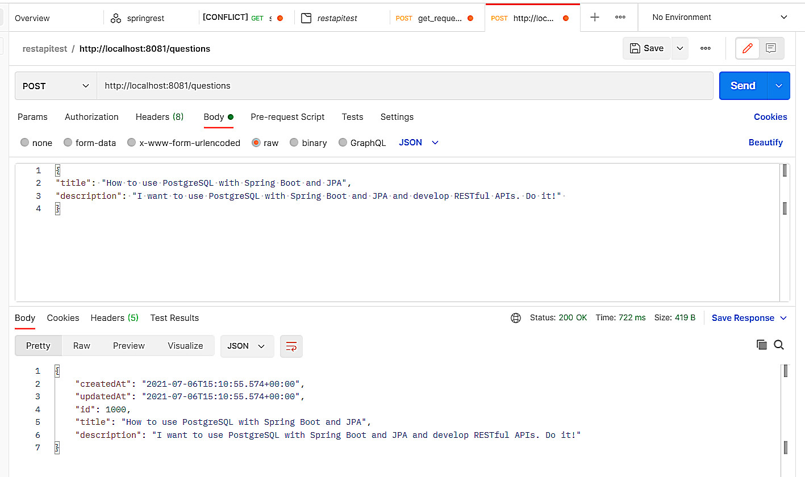
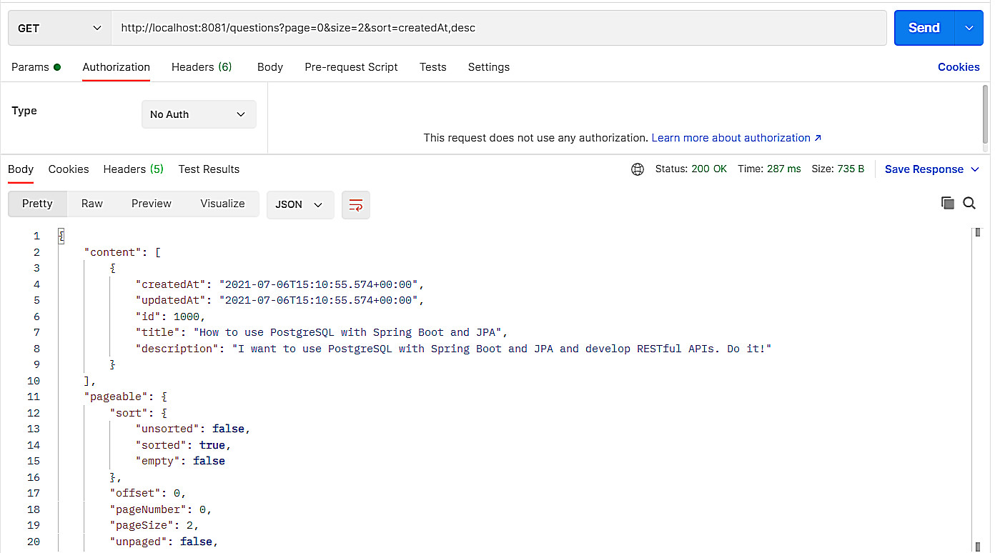
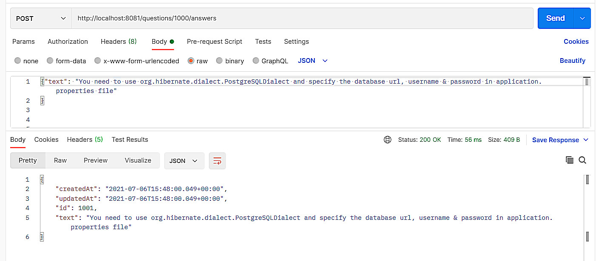
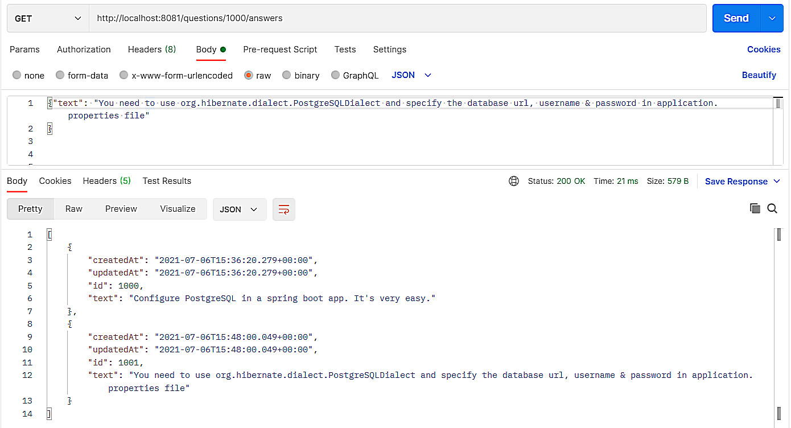
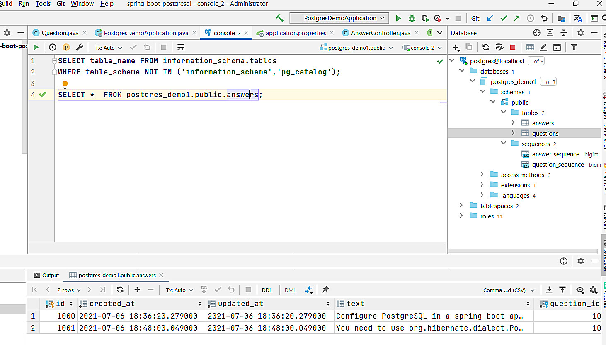

# Spring Boot, PostgreSQL, JPA, Hibernate REST API Example

## Technology stack:
    Spring Boot 2;
    Spring Web;
    Spring Data;
    PostgreSQL database;
    Hibernate;    

### The application will start on the default port 8081.
**In the application.properties file you must specify the database name, user n In the application.properties file you must specify the database name, user naame and password
**

## The following screenshots show you how to test the APIs using Postman.

1. Create Question POST /questions

2. Get Questions GET /questions?page=0&size=2&sort=createdAt,desc

3. Create Answer POST /questions/{questionId}/answers

4. Get all answers of a Question GET /questions/{questionId}/answers

In intellijIDEA you can see the database schema, tables, fields, etc.
You can make SQL queries to the database to see the contents of the tables.

